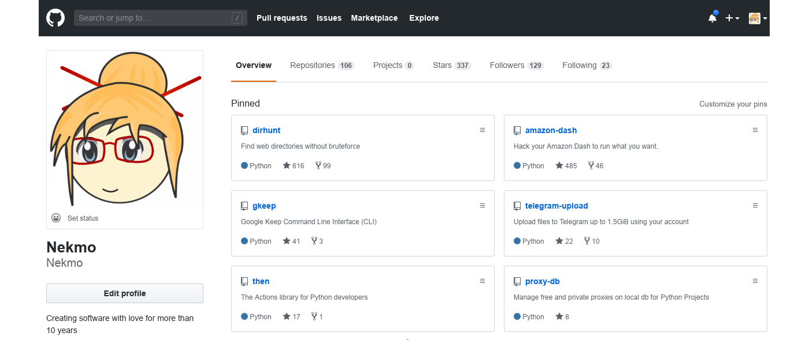
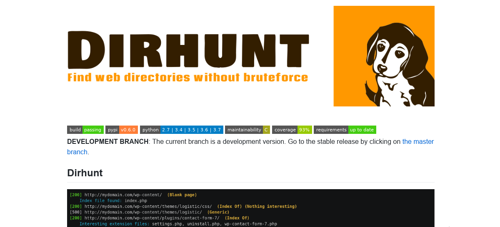
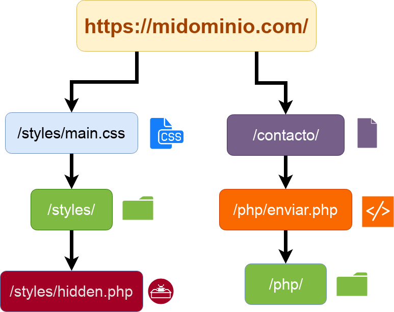
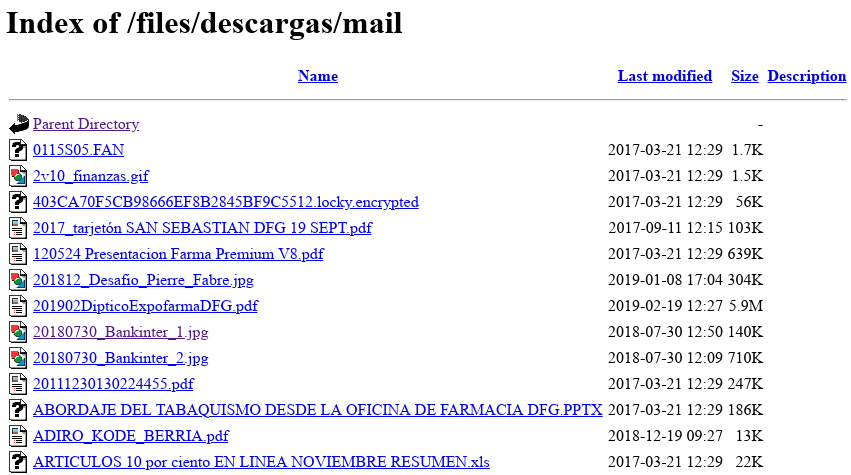
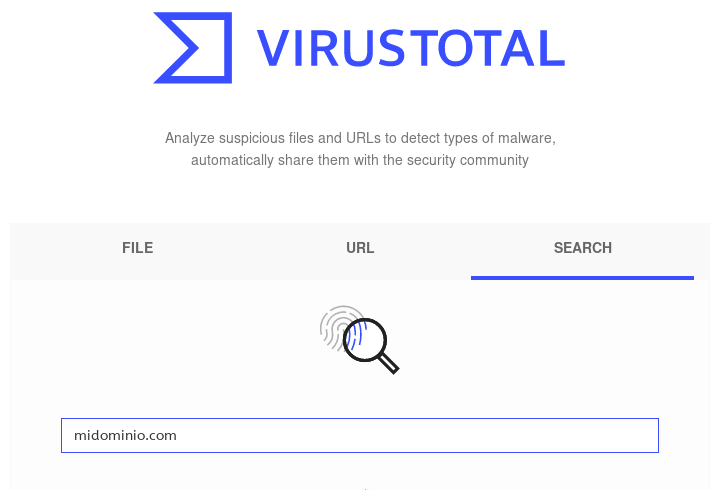
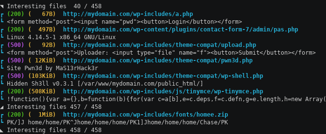

@title[Dirhunt]


<br>
@css[project-name](DIRHUNT)
@css[template-note](Busca directorios sin fuerza bruta)

---?image=assets/image/bg/gray.jpg&position=top&size=100% 20%
@title[sobre-mi]

@snap[north text-white span-100]
@size[1.5em](Mi perfil en Github)
@snapend




Note:
Buenas, soy **Juan José**, conocido en Github como **Nekmo** y llevo 13 años desarrollando en Python; estoy 
especializado en seguridad informática en Hispasec Sistemas.

---?image=assets/image/bg/orange.jpg&position=bottom&size=100% 20%
@title[github-dirhunt]

@snap[south text-white span-100]
@size[1.5em](Repositorio de Dirhunt en Github)
@snapend



Note:
A parte, en mi tiempo libre desarrollo Dirhunt, una herramienta para descubrir contenido de aplicaciones web, la cual 
es software libre y puede encontrarse en Github. 

---?image=assets/image/bg/blue.jpg&position=left&size=30% 100%

@snap[west text-16 text-bold text-italic text-orange span-30]
Más de 600 estrellas
@snapend

@snap[east fragment]
@img[github-stars span-40](assets/image/github_stars.png)
@snapend

Note:
Ha tenido una buena acogida y a día de hoy se puede considerar un proyecto maduro.

---?image=assets/image/bg/blue.jpg&position=right&size=30% 100%

@snap[east span-30 text-11 text-white]
¿En qué se diferencian?
@snapend

Note:
¿Pero en qué se diferencia esta herramienta?

(listar otras alternativas como Cansina)

---

```text
http://dominio/AAAAAAA.php
               AAAAAAB.php
               AAAAAAC.php
```

Note:
Estas herramientas normalmente realizan fuerza bruta desde un diccionario, lo cual requiere muchos intentos. Vamos, 
**algo que podría hacer un mono**.

---?image=assets/image/monkey.webp
@title[mono]
   
@snap[north-east text-white]
O más bien, este mono
@snapend

---



Note:
En cambio, Dirhunt es un crawler que analiza el contenido para encontrar nuevas rutas.

---

Note:
Recorre los directorios de los assets de la página. Sigue los enlaces internos de la web para encontrar nuevas 
páginas. **¿Y para qué sirve esto?**

---

@snap[north-west]
Usos
@snapend

@snap[south-west list-content-concise span-100]
@ul
- Revelar los directorios del sitio.
- Detectar plugins e información del software.
- Encontrar malware y ficheros de configuración.
- ... Entre otras cosas.
@ulend
@snapend

Note:
 (leer listado) ... Por ejemplo, tengo un amigo que lo usa para obtener información de   
sitios web para SEO.

---




Note:
Pero cuando Dirhunt es especialmente potente, es en aquellos sitios con el Index Of habilitado. 

---

### ¿Pero qué pasa si no hay assets, enlaces ni Index Of habilitado?

Note:
Pero por si no hay formas de obtener enlaces ni carpetas de la página principal, también tiene otros trucos:

---

### Google


Note:
También realiza una búsqueda en Google con el dominio para obtener carpetas.

---

### VirusTotal




Note:
Busca en VirusTotal por el dominio.

---

### Robots.txt

```text
User-agent: googlebot
Disallow: /directory1/
Disallow: /directory2/
Allow: /directory2/subdirectory1/
```

Note:
El robots.txt suele tener directorios interesantes, y también los usa para encontrar más directorios.

---

* Filtros por flags
* Reporta páginas en blanco en directorios.
* Detecta falsos 404.

Note:
Los resultados pueden filtrar por flags, reporta las páginas en blanco que ocultan contenido en directorios y los 
falsos 404.

---



Note:
Finalmente, los resultados son mostrados al final junto con un resumen, y el tamaño y la fecha si el fichero viene de  
un Index Of.

---

Note:
Con Dirhunt hace falta hacer muchas menos peticiones, pero por si hace falta, también hay buenas opciones para las 
peticiones:

---

* Define uno o varios proxies.
* Delay entre peticiones.
* Búsqueda automática de proxies gratuitos, aleatorios o por países.

---

```
$ sudo pip3 install dirhunt
```

O haz tu fork de [Nekmo/dirhunt](https://github.com/Nekmo/dirhunt) en Github.

---
@title[presentación]

## ¿Y la presentación?

* Presentación: [github:Nekmo/dirhunt-presentacion](https://github.com/Nekmo/dirhunt-presentacion)

---
@title[contactar]

## Contactar


@snap[west contact-links]
@css[contact-name](Nekmocom)<br>
<a href="https://github.com/gitpitch/gitpitch">
@fa[github-square pad-right-icon]@css[git-handle](Nekmo)
</a><br>
<a href="https://twitter.com/nekmocom">
@fa[twitter-square pad-right-icon]@css[twitter-handle](@nekmocom)
</a><br>
<a href="mailto: david@gitpitch.com">
@fa[envelope-o pad-right-icon]@css[contact-email](contacto@nekmo.com)
</a>
@snapend

@snap[east span-50]

@snapend

@snap[north-east template-note text-gray]
Formas de contacto.
@snapend


---

@title[acerca-tec]
## Tecnologías previas

* **Django** desde *versión 1.1* (2009)
* **AngularJS** desde *versión 1.1* (2013)

Note:
En mi caso, antes de usar Angular 4, tenía 8 años experiencia usando Django, y había estado usando AngularJS desde 
hace 5, **por lo que el cambio de tecnología fue algo difícil. Tuve que cambiar mi forma de trabajar.**

---
@title[dificil]


---
@title[experiencia-angular]

## <span style="font-size: 200%"><span style="color: #FEFEFE">Django</span> + <span style="color: #092E20">Angular</span></span>


Note:
Así que esta presentación no va a ir sobre cómo volverse un profesional de Angular y Django en tan sólo 45 minutos... 
Sino sobre mis errores y experiencias. Y cómo aprendí conjuntar ambas tecnologías antes del deadline

---
@title[mis-errores]


---
@title[experiencia-django]


Note:
Para esta presentación, se presupone que ya se cuenta con conocimientos al menos de Django, 
aunque no hace falta de Angular.


---
@title[contenido]

## En esta presentación:

* **Comparación** entre Angular y Django
* Formas de utilizar Angular
* Angular **CLI**
* **Conectando** Angular y Django
* **Demo** técnica
* Paso a **producción**

Note:
En esta presentación vamos a ver (...) pero antes, vamos a hacer una pequeña presentación de Django y Angular


---
@title[django]

### **Django** es un **framework web** de servidor en **Python**. Algunas características:

* **ORM** propio
* **Administración**
* **Middleware**
* Sistema de **rutas**
* Lenguaje de **plantillas**
* **Controlador** (llamadas vistas)

Note:
(...) ahora veamos Angular

---
@title[angular]

### **Angular** es un **framework web** de cliente en **JS/TypeScript**. Algunas características:

* Web Apps **progresivas**
* **Multiplataforma** (web, escritorio, móvil...)
* **Optimización** web (code splitting, Universal...)
* Sistema de **rutas**
* Lenguaje de **plantillas**
* **Controlador** (llamados componentes)


Note:
(...) y... controlador. Como vemos, ambos frameworks tienen varios elementos en común.


---?image=assets/image/facepalm.webp&size=auto 70%&color=#83CB8B


---
@title[conflictos]

### Elementos **comunes** entre ambos

<table>
  <tr>
    <th>Django</th>
    <th>Angular</th>
  </tr>
  <tr>
    <td>...</td>
    <td>...</td>
  </tr>
  <tr>
    <td>Sistema de rutas</td>
    <td>Sistema de rutas</td>
  </tr>
  <tr>
    <td>Lenguaje de plantillas</td>
    <td>Lenguaje de plantillas</td>
  </tr>
  <tr>
    <td>Controladores</td>
    <td>Controladores</td>
  </tr>
</table>


Note:
Estos elementos son (...) ¿y ahora qué hacemos?


---
@title[clasico]

### Método clásico

**Django** se encarga de las **rutas, las plantillas y los controladores** (views).


Note:
Dejamos a Django encargarse de (...). Este método es muy popular en AngularJS, la primera versión de Angular.

---
@title[clasico-2]

Usado por **Djangular** (AngularJS). Se incluye AngularJS **en templates** de Django **a demanda**.

*Este método puede usarse en **Angular 2+** con **SystemJS**.*


Note:
Es usado por ejemplo en Djangular, una biblioteca para AngularJS en Django. Ésta es la forma en que muchos 
nos encontrábamos acostumbrados. Un método similar se encontraba documentado para Angular 4 mediante SystemJS.  


---
@title[clasico-3]

```html
...

<!-- This SystemJS configuration loads umd packages 
     from the web -->
<script src="systemjs.config.server.js"></script>
 
 <script>
   System.import('main.js')
         .catch(function(err){ console.error(err); });
 </script>
```

Note:
Aquí encontramos un ejemplo.


---
@title[clasico-4]

### No apropiado para Angular 2+

* Su **configuración** y uso es **complicada**
* Requiere **adaptación** con cada módulo instalado
* Se pierden las **características** de Angular CLI
* Ya no se encuentra **documentado**

Note:
No obstante, este método puede ser frustrante si se está empezando con Angular, ya que (...). 
Eso nos deja una segunda opción.


---
@title[cli]

## Angular Cli

**Angular** se encarga de las **rutas, las plantillas y los controladores** (componentes).


Note:
Con este método, Angular se encarga de (...). Angular Cli es el método recomendado para Angular.


---
@title[cli-2]

### Características

* Gestión de **configuración** y **paquetes**
* **Generar** proyectos, componentes, servicios...
* **Comprobación** de código, tests
* **Compilar** (modos dev y prod.) y **ejecución**


Note:
Angular Cli tiene un montón de características interesantes. (...)


---
@title[cli-3]

### Guía rápida

1. **Crear** nuevo proyecto: `ng new my-app`
2. **Iniciar** proyecto: `ng serve --open`
3. ¡Listo!


Note:
Para crear un proyecto sólo tenemos que (...) e iniciamos el proyecto. Se compilará en tiempo real, se quedará 
el servidor de Angular escuchando a cambios y se abrirá un navegador con el proyecto.


---
@title[api]

### ¿Y dónde queda Django?

Ahora tenemos **2 servidores** ejecutándose en desarrollo:

* `manage.py runserver` (Django) en el puerto 8000.
* `ng serve` (Angular) en el puerto 4200.

*¿Cómo trabajar con ambas tecnologías a la vez?*


Note:
Si antes sólo teníamos que ejecutar el servidor de Django, ahora también tenemos que tener en ejecución el de 
Angular mientras desarrollamos. ¿Pero cómo conectamos ambas tecnologías?

---
@title[api-2]

## Formas de conectar

* **Django Rest Framework**
* **Django Channels**
* **Graphene Django** (GraphQL)
* ... entre otros.


Note:
Django incluye varias bibiotecas para API, entre las que destacamos (...)

---
@title[drf]

### Django Rest Framework

* **API Web** navegable
* Potentes formas de **serialización y autenticación**
* Muy **personalizable** y **adaptable**
* **Documentación automática**
* Gran **soporte y comunidad**


Note:
Django Rest Framework es la biblioteca más popular por la comunidad. Ofrece una API REST, una 
solución fácil de usar y con buen soporte. Entre sus características destacamos (...)


---
@title[api-rest-ejemplo]

### Ejemplo

```typescript
export class HeroApiService {
    constructor(private http: HttpClient) { }

    // ...
    getHero(id: number): Observable<Hero> {
      const url = `/api/heroes/${id}/`;
      return this.http.get<Hero>(url).pipe(
        tap(_ => this.log(`fetched hero id=${id}`)),
        catchError(this.handleError<Hero>(`getHero id=${id}`))
      );
    }
}
```

@[7-10](Conexión a la API de Django usando HttpClient.)


Note:
Aquí podemos ver un ejemplo basado en el tutorial de Angular, de cómo obtener un objeto
Hero desde la API de Django. El código está en TypeScript, el lenguaje recomendado para 
Angular.


---
@title[proxy]

### Conectar cliente Angular a Django

* El navegador ejecuta `http://localhost:4200`
* ... pero la **API de Django** se encuentra accesible en `http://localhost:8000`.

Para conectarlos de forma transparente, podemos usar **proxies** en el **servidor de Angular**.


Note:
Aunque el cliente web que ejecuta Angular ya tiene una forma de conectarse a Django, los 
navegadores bloquean conexiones entre diferentes sitios por seguridad. Para solucionarlo, 
haremos que la API de Django sea accesible desde el servidor de Angular


---?code=src/proxy.conf.json&lang=json&title=Proxy de Angular a Django

@[3](Proxy a la API de Django)


Note:
Creamos un archivo de configuración llamado `proxy.conf.json`, donde mapeamos un path con la 
dirección a la que debe conectarse.


---?code=src/angular.json&lang=json&title=Usar config. proxy
@[7](Configuración proxy)


Note:
Y para que use este archivo de configuración al ejecutar `ng serve`, editamos el fichero 
`angular.json`.


---
@title[ejemplo]


## Ahora veámoslo en acción

[Github:nekmo/django-angular2-example](https://github.com/Nekmo/django-angular2-example)

Note:
He preparado una demo para demostrar el funcionamiento de Angular junto Django. Esta demo 
construida sobre el tutorial de Django Rest Framework.


---
@title[producción]

## Paso a producción: Angular CLI

* **Optimiza y minifica** dependencias y código
* **Compila** TypeScript y Sass
* **Concatena** y añade **hash** para caché
* **Entornos** diferenciados: `dev` y `prod`


---
@title[producción-2]

### Comando build

Para **compilar** para **producción**:

```bash
$ ng build --prod
```

Note:
Este comando construye Angular para producción. El directorio de salida por defecto es la 
carpeta dist, dentro del proyecto de Angular.


---?code=src/index.html&lang=html&title=Archivo index generado


Note:
Se crea en el directorio los archivos javascript compilados junto con todo lo necesario para 
ejecutar el proyecto en producción. Se genera también un index.html, que es el que se sirve.


---?code=src/angular-2.json&lang=json&title=Directorio de salida
@[6](Directorio de salida)


Note:
No obstante, el directorio de salida por defecto no nos hace fácil servirlo en producción. Es 
posible cambiar este directorio para que escriba a un directorio de static de Django, y luego 
que collectstatic se encargue de ponerlo en su sitio.


---
@title[producción-5]

### Servir index.html con Django

Tenemos 2 opciones:

1. Servirlo con **Nginx**
2. Servirlo con **Django**


Note:
Hay varias formas para servir el index.html generado. No obstante, propongo 2: (...). Pero 
en mi caso me he decantado por la segunda.


---?code=src/views.py&lang=python&title=Servirlo con Django
@[10-12](View para servir el index)


Note:
Esta opción mediante Django es tan buena como cualquier otra. Hay una caché para hacerlo más 
eficiente. Y con esto, ya está todo para tener Angular con Django en producción.


---
@title[muchas-gracias]

## ¡Muchas gracias por venir!

Referencias:

* [Angular Docs](https://angular.io/docs)
* [Angular-cli proxy](https://github.com/angular/angular-cli/blob/master/docs/documentation/stories/proxy.md)
* [Angular-cli build](https://github.com/angular/angular-cli/wiki/build)
* [Building Modern Web Apps with Python](https://www.techiediaries.com/django-angular-cli/)


---
@title[presentación]

## ¿Y la presentación?

* Presentación: [github:Nekmo/django-angular2-presentation](https://github.com/Nekmo/django-angular2-presentation)
* Demo: [github:Nekmo/django-angular2-example](https://github.com/Nekmo/django-angular2-example)
* Lib en desarrollo: [github:Nekmo/django-angular2](https://github.com/Nekmo/django-angular2-example)


---
@title[contactar]

## Contactar

* Email: [contacto@nekmo.com](mailto:contacto@nekmo.com)
* Telegram: [@nekmo](https://t.me/nekmo)
* Jabber: [nekmo@nekmo.org](xmpp://nekmo@nekmo.org)


